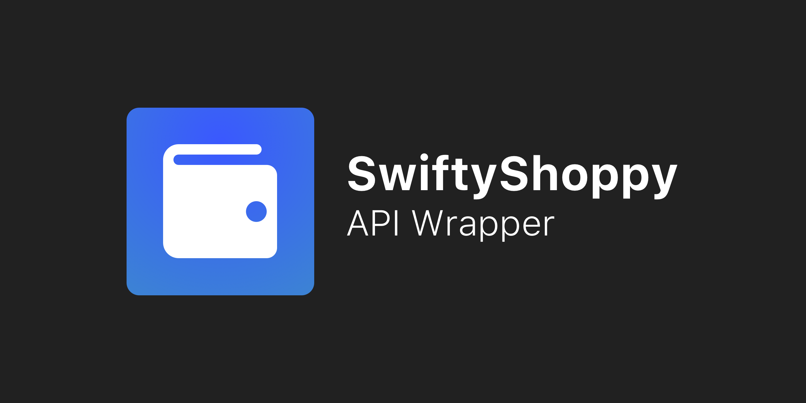

    

# SwiftyShoppy

> SwiftyShoppy is an API wrapper for shoppy.gg selling service.
> This API is built on top of Moya and aims to reproduce as soon as possible the full API proposed on [shoppy.dev](shoppy.dev) and also some private API routes such as analytics and profile settings.

## Installation
SwiftyShoppy can be installed via Swift Package Manager.

### Install from XCode
1. Select `File / Swift Package / Add package dependency` from the menu
2. Paste `https://github.com/vlourme/SwiftyShoppy.git`
3. Follow the steps

### Install for a package
1. Add this line to your `Package.swift`, in the dependencies array: `
.package(url: "https://github.com/vlourme/SwiftyShoppy.git", .upToNextMajor(from: "1.0.0"))
`

## Contribute
Issues, questions and pull requests are welcome. If you want to help in the development, you should know how tests are working.

You'll need to register at shoppy.gg and get your API key to paste it in `Tests/SwiftyShoppyTests/Keys.swift`
